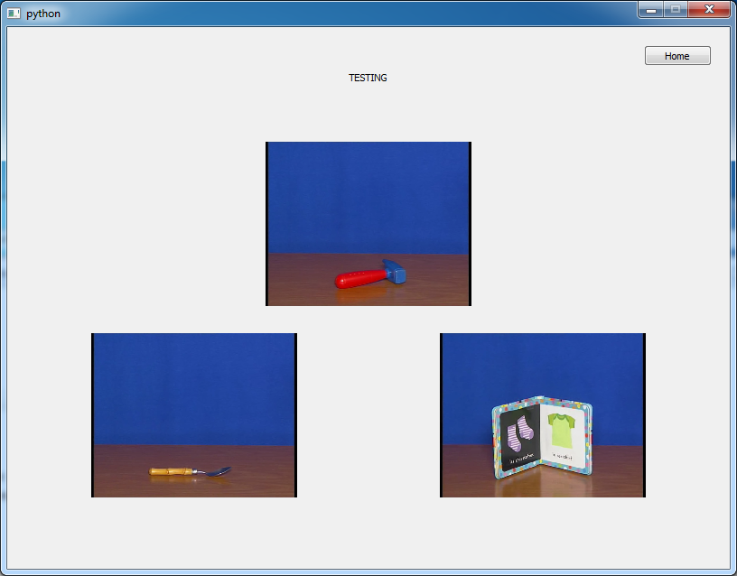

# DANASOFT 

DanaSoft is a python interface based on PyQt4. 



## Installation

1.  If you are using Anaconda create a new environment with python's version 2.7 :

   ```shell
   conda create -n danasoft_env python=2.7
   activate danasoft_env
   ```

2. Manual install PyQt4 on this environment

3. Install numpy : conda install numpy

4. Download **danasoft** from github :

   ```shell
   git clone https://github.com/tinmarD/DanaSoft
   ```


## Data Directory 

The data files are not provided on github to save space. 

You need to set the data directory path in the *config.py* file at line 10 : 

```python
SOFT_NAME = "Dana Soft"
DATA_PATH = r'C:\Path\to\data\directory'
```

## Launch

Open the file danasoft/danasoft.py with python 


